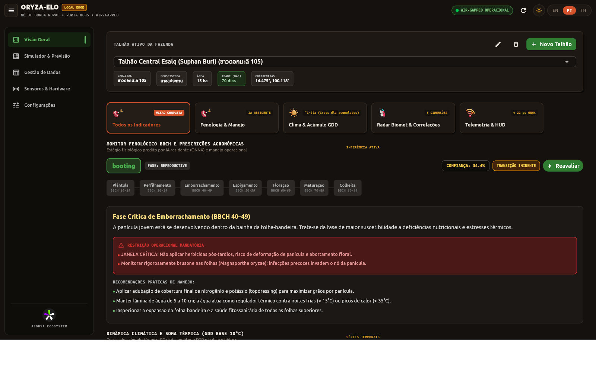
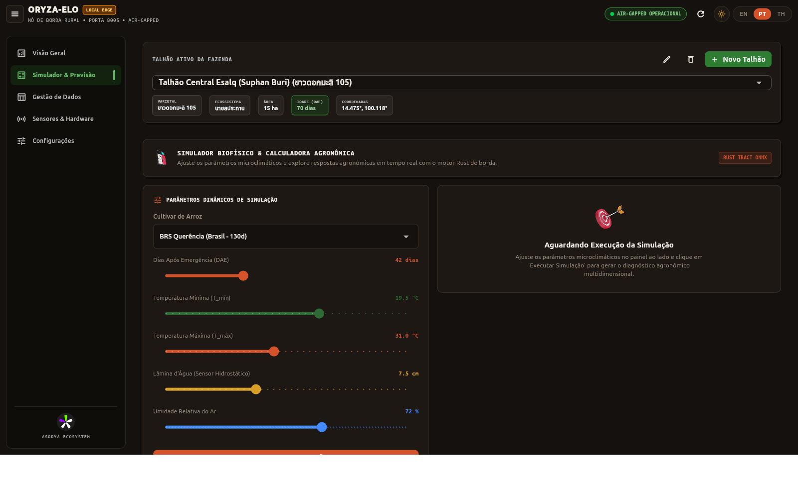
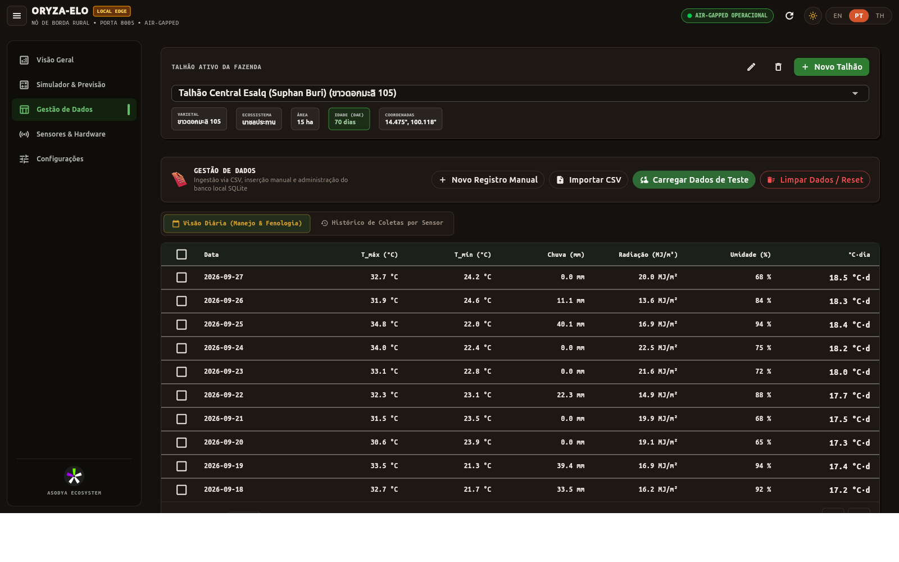
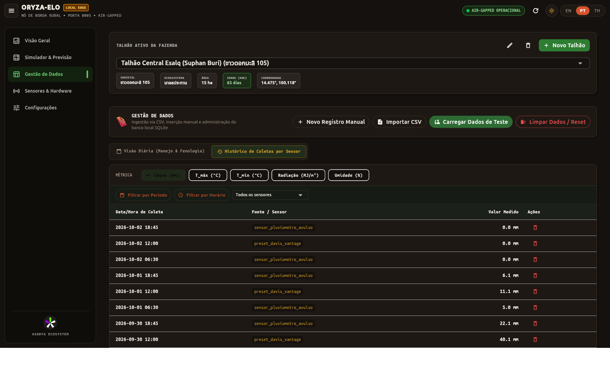
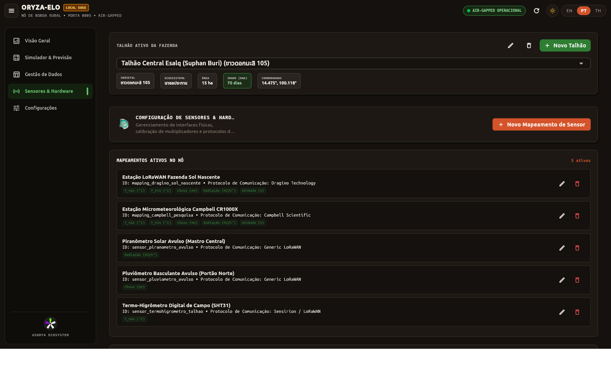
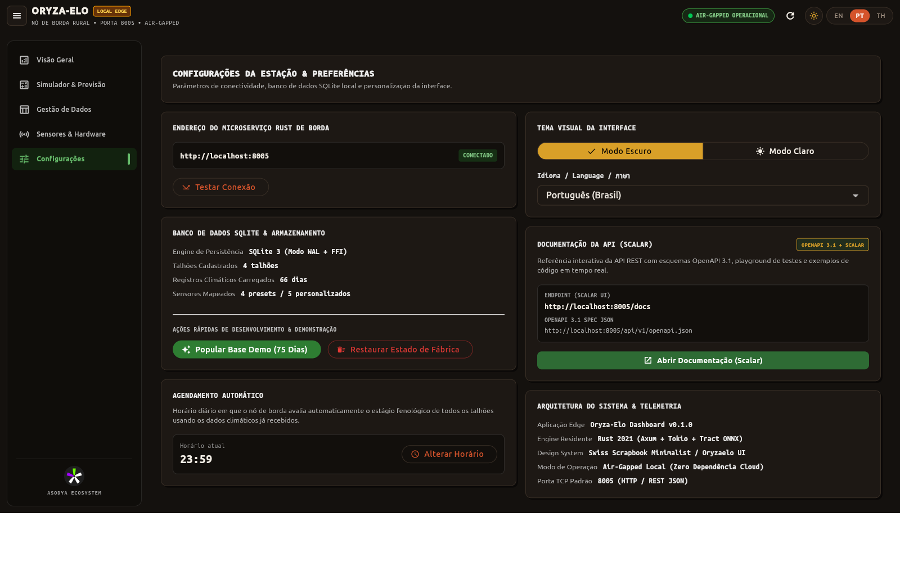
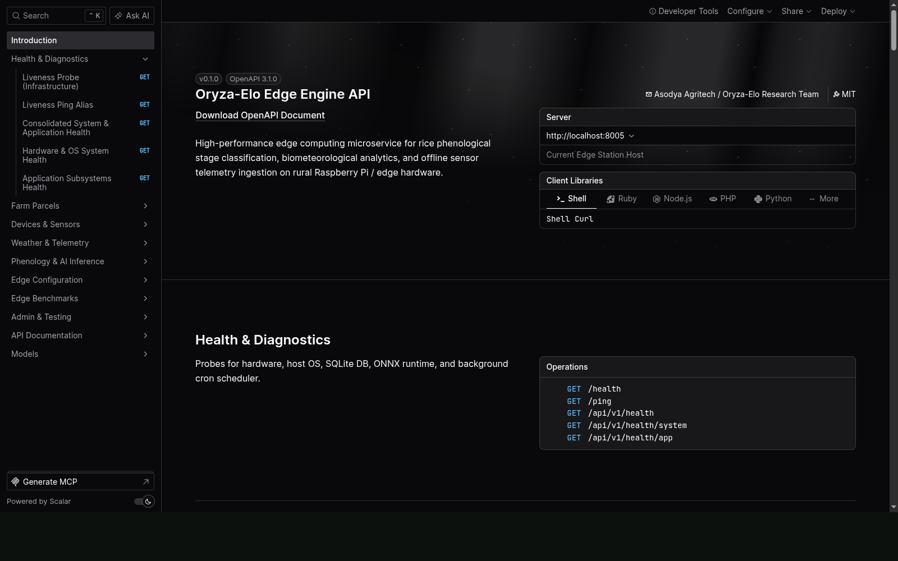

<div align="center">

# Oryza-Elo Engine

**Offline rice phenology classification at the rural edge.**
A Rust microservice that turns field weather into the rice crop's growth stage, in microseconds, on a Raspberry Pi.

[](https://oryza-elo.asodya.com/)
[](LICENSE)
[](Cargo.toml)
[](https://github.com/microsoft/onnxruntime)
[](src/dal/research/04_rust_edge_inference_benchmark.md)

[Website](https://oryza-elo.asodya.com/) · [Install](#quick-start) · [Dashboard gallery](https://oryza-elo.asodya.com/#/preview) · [How to use](https://oryza-elo.asodya.com/#/how-to-use) · [Research](#model-and-data)

<br>



<sub>Local dashboard served by the engine itself: current phenological stage, management guidance and field indicators, with no internet required.</sub>

</div>

---

## What it does

Oryza-Elo Engine runs on a small computer installed at the farm. It ingests weather readings (from field sensors, a CSV file or manual entry), computes agrometeorological features such as growing degree days, and classifies the current phenological stage of the rice crop with a lightweight tree model exported to ONNX. Everything runs locally: the dashboard, the database and the model work without an internet connection.

- **Edge first:** a single Rust binary (Axum + SQLite) that also serves the farmer dashboard on the local network.
- **Fast and light:** 56.8 µs average inference on a Raspberry Pi 5, about 68 MB of resident memory for the whole service.
- **Flexible ingestion:** sensor presets, CSV upload, single readings and manual records, with field-level provenance.
- **Automatic routine:** a nightly job (23:59 by default, configurable) recomputes features and predictions, and catches up after a reboot.
- **Trilingual interface:** Portuguese, English and Thai.
- **Documented API:** interactive OpenAPI 3.1 reference (Scalar) built into the service.

## Quick start

The installer detects the CPU architecture (x86_64, aarch64 or armv7l) and the service manager (systemd, OpenRC or runit), installs the service under `/opt/oryzaelo_engine` and starts it on port **8005**.

```bash
curl -fsSL https://oryza-elo.asodya.com/install.sh | bash
```

> [!NOTE]
> There is no prebuilt release yet, so the installer compiles the engine from source. Install the build tools and Rust first:
>
> ```bash
> sudo apt install -y build-essential pkg-config libssl-dev git
> curl --proto '=https' --tlsv1.2 -sSf https://sh.rustup.rs | sh -s -- -y
> source ~/.cargo/env
> ```
>
> On a Raspberry Pi 5 the first build takes a few minutes.

Then open the dashboard from any device on the same network:

| What | Where |
| :--- | :--- |
| Dashboard | `http://<station-ip>:8005` |
| API reference (Scalar) | `http://<station-ip>:8005/docs` |
| OpenAPI document | `http://<station-ip>:8005/openapi.json` |
| Health check | `http://<station-ip>:8005/health` |

To explore with sample data, use **Sensor Ingestion > Load Demo Farm Data** in the dashboard, or:

```bash
curl -X POST http://localhost:8005/api/v1/admin/populate
```

### Run from source

```bash
git clone https://github.com/wilsonborba/oryzaelo_engine.git
cd oryzaelo_engine
cargo run --release
```

The model is loaded from `src/dal/data/processed/models/`, so run the binary from the repository root (the installed service does the same through its working directory).

## Configuration

The installer writes `/opt/oryzaelo_engine/.env`. Edit it and restart the service (`sudo systemctl restart oryzaelo_engine`).

| Variable | Default | Purpose |
| :--- | :--- | :--- |
| `SERVER_HOST` | `0.0.0.0` | Interface the API listens on |
| `SERVER_PORT` / `PORT` | `8005` | HTTP port for the API and the dashboard |
| `STATIC_DIR` | `/opt/oryzaelo_engine/web` | Folder with the dashboard build served by the engine |
| `LOG_LEVEL` | `info` | Log verbosity |
| `RICE_BASE_TEMPERATURE_CELSIUS` | `10.0` | Base temperature for growing degree days |

## API overview

All application routes live under `/api/v1`. The full, interactive reference is at `/docs`.

| Area | Main routes |
| :--- | :--- |
| Health | `GET /health`, `GET /api/v1/health/system`, `GET /api/v1/health/app` |
| Fields | `GET, POST /api/v1/parcels`, `/api/v1/parcels/:id` |
| Devices | `GET /api/v1/devices/presets`, `/api/v1/devices/mappings` |
| Weather | `POST /api/v1/weather/upload-csv`, `POST /api/v1/weather/record`, `POST /api/v1/weather/sensor-reading`, `GET /api/v1/weather/records`, `GET /api/v1/weather/analytics` |
| Phenology | `POST /api/v1/phenology/predict`, `POST /api/v1/phenology/simulate`, `GET /api/v1/phenology/latest`, `GET /api/v1/phenology/history` |
| Benchmarks | `GET /api/v1/benchmarks/latency`, `/biomet`, `/storage`, `/throughput` |
| Settings | `GET, PUT /api/v1/config` |

## Model and data

| | |
| :--- | :--- |
| **Field data** | 2,398 open-data field surveys from the Rice Department of Thailand (catalog package `rdservey_11_01`), 58 provinces, January 2023 to September 2025 |
| **Weather** | Daily NASA POWER series (temperature, rainfall, radiation, humidity) linked to each survey by coordinates and date |
| **Features** | 44 inputs: 32 climate features over 7, 14, 30 and 60 day windows (growing degree days with base 10 °C, rainfall, dry spells, diurnal temperature range, radiation, humidity), 9 derived features (photoperiod, photothermal quotient, vapor pressure deficit proxy, calendar, location) and 3 categorical codes |
| **Target** | 7 stages: seedling, tillering, booting, heading, flowering, pre-harvest and harvest |
| **Models** | CatBoost, XGBoost and Random Forest; CatBoost exported to ONNX for the edge |

Current results (stratified 5-fold cross-validation, see the reports below):

| Task | Macro-F1 | Note |
| :--- | :---: | :--- |
| 7 stages | 0.57 to 0.59 | Best per-class F1 on tillering (0.755) and pre-harvest (0.748) |
| 3 macro-phases (vegetative, reproductive, ripening) | 0.734 | 87.2% overall accuracy |
| Unseen provinces (grouped by province) | 0.285 | Geographic generalization is the main open challenge |

Edge latency, measured with `GET /api/v1/benchmarks/latency?iterations=1000` (5 rounds):

| Hardware | Mean latency | Worst p99 | Notes |
| :--- | :---: | :---: | :--- |
| Raspberry Pi 5, 8 GB, aarch64 | 56.8 µs | 80 µs | No thermal throttling, 68.4 MB resident memory |
| Intel Core i7-13700HX laptop, x86_64 | 17.2 µs | 87 µs | Same protocol, for comparison |

The research reports with methods, tables and caveats are in [`src/dal/research/`](src/dal/research/):
[exploratory data analysis](src/dal/research/01_exploratory_data_analysis.md) ·
[feature engineering](src/dal/research/02_feature_engineering_report.md) ·
[model benchmarks](src/dal/research/03_baseline_ml_benchmarks.md) ·
[edge inference benchmark](src/dal/research/04_rust_edge_inference_benchmark.md)

## Dashboard gallery

<table>
  <tr>
    <td width="50%"><a href=".github/screenshots/station_simulator.png"></a><br><sub><b>Simulator:</b> test weather scenarios and see the predicted stage</sub></td>
    <td width="50%"><a href=".github/screenshots/station_daily_data.png"></a><br><sub><b>Data management:</b> consolidated daily records with GDD</sub></td>
  </tr>
  <tr>
    <td width="50%"><a href=".github/screenshots/station_sensor_history.png"></a><br><sub><b>Sensor history:</b> raw readings with provenance</sub></td>
    <td width="50%"><a href=".github/screenshots/station_hardware_iot.png"></a><br><sub><b>Sensors and hardware:</b> device presets and mappings</sub></td>
  </tr>
  <tr>
    <td width="50%"><a href=".github/screenshots/station_settings.png"></a><br><sub><b>Settings:</b> station, database, language and schedule</sub></td>
    <td width="50%"><a href=".github/screenshots/station_scalar_docs.png"></a><br><sub><b>API reference:</b> interactive OpenAPI 3.1 docs at /docs</sub></td>
  </tr>
</table>

All images are in [`.github/screenshots/`](.github/screenshots/). For an interactive tour, see the [dashboard preview on the website](https://oryza-elo.asodya.com/#/preview).

## Project structure

```text
src/
├── core/            settings and constants
├── dal/
│   ├── data/        raw survey, enriched dataset and ONNX/CatBoost models
│   ├── database/    SQLite persistence
│   ├── inference/   ONNX Runtime session
│   ├── remote/      NASA POWER client
│   └── research/    reports for EDA, features, models and edge benchmarks
├── domain/          models, services (biometeorology, inference, advisory) and scheduled tasks
├── presentation/    Axum API, CLI and static dashboard mount
├── lib.rs
└── main.rs
install.sh           one-line installer for edge stations
run_local_edge.sh    development launcher (engine plus dashboard build)
```

## Roadmap

- Prebuilt release binaries for aarch64 and x86_64, so the installer no longer needs Rust.
- Better accuracy across the 7 stages and on provinces not seen in training.
- **Future proposal:** optional cloud synchronization for multi-farm analysis. The engine is and will remain fully usable offline.

## About

Oryza-Elo is developed by Wilson Borba as the applied work of an MBA in Software Engineering final project at USP/Esalq (Universidade de São Paulo), and is presented at [oryza-elo.asodya.com](https://oryza-elo.asodya.com/).

Data sources: Rice Department of Thailand open data catalog ([catalog.ricethailand.go.th](https://catalog.ricethailand.go.th/dataset/b7867511-1ec9-4f30-86f9-ec373431a476)) and [NASA POWER](https://power.larc.nasa.gov/).

Released under the [MIT License](LICENSE).
